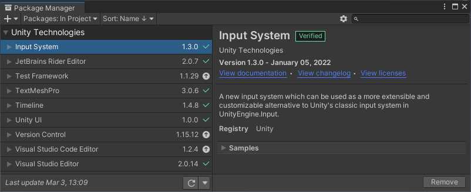

# Unity Virtual Controller

* This input sample shows how to interact with the axises, buttons, and touch available on the developer kit.


* This sample project uses the LTS version: `Unity 2020.3.29f1`

* This sample uses the new [Unity Input System](https://docs.unity3d.com/Packages/com.unity.inputsystem@1.0/manual/QuickStartGuide.html) from the Unity Package manager.



* The [Scene01.unity](Assets/Scenes/Scene01.unity) scene contains the images and logic for the virtual controller.

* The [DracoVirtualControllerUI.cs](Assets\Scripts\DracoVirtualControllerUI.cs) script controls overlay visibility.


* Axises and Buttons are accessed through the `InputSystem.Gamepad`.

```
Gamepad gamepad = Gamepad.current;
if (gamepad == null)
{
    return; // No gamepad connected.
}
```

* Button pressed state maps to the following properties.

```
_mImageA.enabled = gamepad.aButton.isPressed;
_mImageB.enabled = gamepad.bButton.isPressed;
_mImageX.enabled = gamepad.xButton.isPressed;
_mImageY.enabled = gamepad.yButton.isPressed;
_mImageDpadDown.enabled = gamepad.dpad.down.isPressed;
_mImageDpadLeft.enabled = gamepad.dpad.left.isPressed;
_mImageDpadRight.enabled = gamepad.dpad.right.isPressed;
_mImageDpadUp.enabled = gamepad.dpad.up.isPressed;
_mImageLeftBumper.enabled = gamepad.leftShoulder.isPressed;
_mImageLeftThumb.enabled = gamepad.leftStickButton.isPressed;
_mImageRightBumper.enabled = gamepad.rightShoulder.isPressed;
_mImageRightThumb.enabled = gamepad.rightStickButton.isPressed;
_mImageSelect.enabled = gamepad.selectButton.isPressed;
_mImageStart.enabled = gamepad.startButton.isPressed;
```

* Axis values are accessed through the following properties.

```
_mImageLeftTrigger.enabled = Mathf.Abs(gamepad.leftTrigger.ReadValue()) >= _mDeadZone;
_mImageRightTrigger.enabled = Mathf.Abs(gamepad.rightTrigger.ReadValue()) >= _mDeadZone;
Vector2 ls = gamepad.leftStick.ReadValue(); //left stick
Vector2 rs = gamepad.rightStick.ReadValue(); //right stick
```

* Tap access requires `Enhanced Touch Support`.

```
void Awake()
{
    EnhancedTouchSupport.Enable();
    TouchSimulation.Enable();
}
```

* Tap event detection required `EnhancedTouch`.

```
UnityEngine.InputSystem.EnhancedTouch.Touch[] activeTouches =
  UnityEngine.InputSystem.EnhancedTouch.Touch.activeTouches.ToArray();

foreach (UnityEngine.InputSystem.EnhancedTouch.Touch touch in activeTouches)
{
    if (touch.isInProgress)
    {
        touchDetected = true;
        break;
    }
}
```
